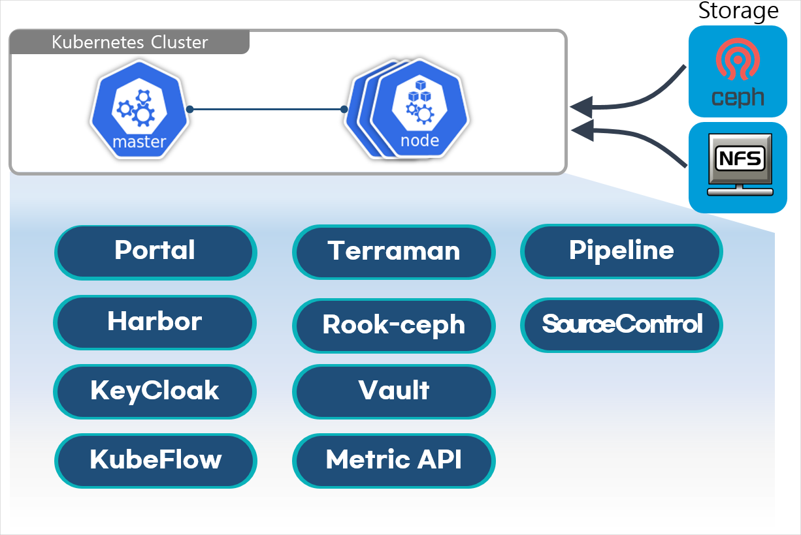

### [Index](https://github.com/PaaS-TA/Guide/blob/master/README.md) > [CP Install](/install-guide/Readme.md) > 단독형 배포 포털 설치 가이드

<br>

>[v1.2](/install-guide/container-platform-portal/paas-ta-container-platform-portal-deployment-standalone-guide-v1.2.md)

>v1.3 (Current)

## Table of Contents

1. [문서 개요](#1)  
    1.1. [목적](#1.1)  
    1.2. [범위](#1.2)  
    1.3. [시스템 구성도](#1.3)  
    1.4. [참고 자료](#1.4)  

2. [Prerequisite](#2)  
    2.1. [방화벽 정보](#2.1)  
    2.2. [NFS Server 설치](#2.2)    

3. [컨테이너 플랫폼 포털 배포](#3)  
    3.1. [컨테이너 플랫폼 포털 배포](#3.1)  
    3.1.1. [컨테이너 플랫폼 포털 Deployment 파일 다운로드](#3.1.1)  
    3.1.2. [컨테이너 플랫폼 포털 변수 정의](#3.1.2)    
    3.1.3. [컨테이너 플랫폼 포털 배포 스크립트 실행](#3.1.3)  
    3.1.4. [(참조) 컨테이너 플랫폼 포털 리소스 삭제](#3.1.4)

4. [컨테이너 플랫폼 운영자/사용자 포털 접속](#4)      
    4.1. [컨테이너 플랫폼 운영자 포털 로그인](#4.1)      
    4.2. [컨테이너 플랫폼 사용자 포털 회원가입/로그인](#4.2)      
    4.3. [컨테이너 플랫폼 사용자/운영자 포털 사용 가이드](#4.3)          

5. [컨네이너 플랫폼 포털 참고](#5)       
    5.1. [운영자 Cluster Role Token 생성](#5.1)  
    5.2. [Kubernetes 리소스 생성 시 주의사항](#5.2)    


## <div id='1'>1. 문서 개요
### <div id='1.1'>1.1. 목적
본 문서(컨테이너 플랫폼 단독 배포 형 포털 설치 가이드)는 Kubernetes Cluster를 설치하고 컨테이너 플랫폼 단독 배포 형 포털 배포 방법을 기술하였다.<br>
<br>

### <div id='1.2'>1.2. 범위
설치 범위는 Kubernetes Cluster 배포를 기준으로 작성하였다.

<br>

### <div id='1.3'>1.3. 시스템 구성도
<p align="center"></p>    

시스템 구성은 **Kubernetes Cluster(Master, Worker)** 환경과 데이터 관리를 위한 **네트워크 파일 시스템(NFS)** 스토리지 서버로 구성되어 있다. Kubespray를 통해 설치된 Kubernetes Cluster 환경에 컨테이너 플랫폼 포털 이미지 및 Helm Chart를 관리하는 **Harbor**, 컨테이너 플랫폼 포털 사용자 인증을 관리하는 **Keycloak**, 컨테이너 플랫폼 포털 메타 데이터를 관리하는 **MariaDB(RDBMS)** 등 미들웨어 환경을 컨테이너로 제공한다. 총 필요한 VM 환경으로는 **Master Node VM: 1개, Worker Node VM: 1개 이상, NFS Server : 1개**가 필요하고 본 문서는 Kubernetes Cluster에 컨테이너 플랫폼 포털 환경을 배포하는 내용이다. **네트워크 파일 시스템(NFS)** 은 컨테이너플랫폼에서 기본으로 제공하는 스토리지로 사용자 환경에 따라 다양한 종류의 스토리지를 사용할 수 있다.  

<br>    

### <div id='1.4'>1.4. 참고 자료
> https://kubernetes.io/ko/docs<br>
> https://goharbor.io/docs<br>
> https://www.keycloak.org/documentation

<br>

## <div id='2'>2. Prerequisite
본 설치 가이드는 **Ubuntu 18.04** 환경에서 설치하는 것을 기준으로 작성하였다.

### <div id='2.1'>2.1. 방화벽 정보
IaaS Security Group의 열어줘야할 Port를 설정한다.

- Master Node

| <center>프로토콜</center> | <center>포트</center> | <center>비고</center> |  
| :---: | :---: | :--- |  
| TCP | 111 | NFS PortMapper |  
| TCP | 179 | Calio BGP Network |  
| TCP | 2049 | NFS |  
| TCP | 2379-2380 | etcd server client API |  
| TCP | 6443 | Kubernetes API Server |  
| TCP | 10250 | Kubelet API |  
| TCP | 10251 | kube-scheduler |  
| TCP | 10252 | kube-controller-manager |  
| TCP | 10255 | Read-Only Kubelet API |  
| IP-in-IP (Protocol Num 4) || Calico Overlay Network |  

- Worker Node

| <center>프로토콜</center> | <center>포트</center> | <center>비고</center> |  
| :---: | :---: | :--- |  
| TCP | 111 | NFS PortMapper |  
| TCP | 179 | Calio BGP network |  
| TCP | 2049 | NFS |  
| TCP | 10250 | Kubelet API |  
| TCP | 10255 | Read-Only Kubelet API |  
| TCP | 30000-32767 | NodePort Services |  
| IP-in-IP (Protocol Num 4) || Calico Overlay Network |  

<br>

### <div id='2.2'>2.2. NFS Server 설치
컨테이너 플랫폼 포털 서비스에서 사용할 스토리지 **NFS Storage Server** 설치가 사전에 진행되어야 한다.<br>
NFS Storage Server 설치는 아래 가이드를 참조한다.  
> [NFS Server 설치](../nfs-server-install-guide.md)      

<br>

## <div id='3'>3. 컨테이너 플랫폼 포털 배포

### <div id='3.1'>3.1. 컨테이너 플랫폼 포털 배포

#### <div id='3.1.1'>3.1.1. 컨테이너 플랫폼 포털 Deployment 파일 다운로드
컨테이너 플랫폼 포털 배포를 위해 컨테이너 플랫폼 포털 Deployment 파일을 다운로드 받아 아래 경로로 위치시킨다.<br>
:bulb: 해당 내용은 Kubernetes **Master Node**에서 진행한다.

+ 컨테이너 플랫폼 포털 Deployment 파일 다운로드 :
   [cp-portal-deployment-v1.3.tar.gz](https://nextcloud.paas-ta.org/index.php/s/e7ZqzxP4ZFa6GDG/download)

```
# Deployment 파일 다운로드 경로 생성
$ mkdir -p ~/workspace/container-platform
$ cd ~/workspace/container-platform

# Deployment 파일 다운로드 및 파일 경로 확인
$ wget --content-disposition https://nextcloud.paas-ta.org/index.php/s/e7ZqzxP4ZFa6GDG/download

$ ls ~/workspace/container-platform
  cp-portal-deployment-v1.3.tar.gz

# Deployment 파일 압축 해제
$ tar -xvf cp-portal-deployment-v1.3.tar.gz
```

- Deployment 파일 디렉토리 구성
```
├── script          # 컨테이너 플랫폼 포털 배포 관련 변수 및 스크립트 파일 위치
├── images          # 컨테이너 플랫폼 포털 이미지 파일 위치
├── charts          # 컨테이너 플랫폼 포털 Helm Charts 파일 위치
├── values_orig     # 컨테이너 플랫폼 포털 Helm Charts values.yaml 파일 위치
└── keycloak_orig   # 컨테이너 플랫폼 포털 사용자 인증 관리를 위한 Keycloak 배포 관련 파일 위치
```

<br>

#### <div id='3.1.2'>3.1.2. 컨테이너 플랫폼 포털 변수 정의
컨테이너 플랫폼 포털을 배포하기 전 변수 값 정의가 필요하다. 배포에 필요한 정보를 확인하여 변수를 설정한다.

:bulb: Keycloak 기본 배포 방식은 **HTTP**이며 인증서를 통한 **HTTPS**를 설정하고자 하는 경우 아래 가이드를 참조하여 선처리한다.
> [Keycloak TLS 설정](paas-ta-container-platform-portal-deployment-keycloak-tls-setting-guide.md#2-keycloak-tls-설정)       

<br>

```
$ cd ~/workspace/container-platform/cp-portal-deployment/script
$ vi cp-portal-vars.sh
```

```                                                     
# COMMON VARIABLE
K8S_MASTER_NODE_IP="{k8s master node public ip}"             # Kubernetes Master Node Public IP
K8S_AUTH_BEARER_TOKEN="{k8s auth bearer token}"              # Kubernetes Authorization Bearer Token
NFS_SERVER_IP="{nfs server ip}"                              # NFS Server IP
PROVIDER_TYPE="{container platform portal provider type}"    # Container Platform Portal Provider Type (Please enter 'standalone' or 'service')
....    
```
```    
# Example
K8S_MASTER_NODE_IP="xx.xxx.xxx.xx"                 
K8S_AUTH_BEARER_TOKEN="qY3k2xaZpNbw3AJxxxxx...."                 
NFS_SERVER_IP="xx.xxx.xxx.xx"                                  
PROVIDER_TYPE="standalone"           
```

- **K8S_MASTER_NODE_IP** <br>Kubernetes Master Node Public IP 입력<br><br>
- **K8S_AUTH_BEARER_TOKEN** <br>Kubernetes Bearer Token 입력<br>
   + [[5.1. 운영자 Cluster Role Token 생성]](#5.1) 참고하여 Token 값 생성 후 입력 <br><br>
- **NFS_SERVER_IP** <br>NFS Server Private IP 입력<br>
   + 가이드 [[NFS Server 설치](../nfs-server-install-guide.md)]를 통해 설치된 NFS Server Private IP 입력<br><br>
- **PROVIDER_TYPE** <br>컨테이너 플랫폼 포털 제공 타입 입력 <br>
   + 본 가이드는 포털 단독 배포 형 설치 가이드로 **'standalone'** 값 입력 필요

<br>


#### <div id='3.1.3'>3.1.3. 컨테이너 플랫폼 포털 배포 스크립트 실행
컨테이너 플랫폼 포털 배포를 위한 배포 스크립트를 실행한다.

```
$ chmod +x deploy-cp-portal.sh
$ ./deploy-cp-portal.sh
```
<br>

컨테이너 플랫폼 포털 관련 리소스가 정상적으로 배포되었는지 확인한다.<br>
리소스 Pod의 경우 Node에 바인딩 및 컨테이너 생성 후 Running 상태로 전환되기까지 몇 초가 소요된다.


- **NFS 리소스 조회**
>`$ kubectl get all -n nfs-storageclass`  
```
$ kubectl get all -n nfs-storageclass
NAME                                       READY   STATUS    RESTARTS   AGE
pod/nfs-pod-provisioner-7f9cb9468d-f57vz   1/1     Running   0          2m33s

NAME                                  READY   UP-TO-DATE   AVAILABLE   AGE
deployment.apps/nfs-pod-provisioner   1/1     1            1           2m33s

NAME                                             DESIRED   CURRENT   READY   AGE
replicaset.apps/nfs-pod-provisioner-7f9cb9468d   1         1         1       2m33s
```

- **Harbor 리소스 조회**
>`$ kubectl get all -n harbor`      
```
$ kubectl get all -n harbor
NAME                                           READY   STATUS    RESTARTS        AGE
pod/cp-harbor-chartmuseum-585b475874-x9q2x     1/1     Running   0               3m11s
pod/cp-harbor-core-5677b9fc7c-jvd52            1/1     Running   0               3m11s
pod/cp-harbor-database-0                       1/1     Running   0               3m11s
pod/cp-harbor-jobservice-775f49744f-vnwls      1/1     Running   0               3m11s
pod/cp-harbor-nginx-9bf76d997-scdv4            1/1     Running   0               3m11s
pod/cp-harbor-notary-server-b9865b4bf-2knvs    1/1     Running   0               3m11s
pod/cp-harbor-notary-signer-5f7997474d-xsqgk   1/1     Running   0               3m11s
pod/cp-harbor-portal-69775f785f-k2gz9          1/1     Running   0               3m11s
pod/cp-harbor-redis-0                          1/1     Running   0               3m11s
pod/cp-harbor-registry-7654968dcf-lvnp6        2/2     Running   0               3m11s
pod/cp-harbor-trivy-0                          1/1     Running   0               3m11s

NAME                              TYPE        CLUSTER-IP      EXTERNAL-IP   PORT(S)                       AGE
service/cp-harbor-chartmuseum     ClusterIP   10.233.57.98    <none>        80/TCP                        3m12s
service/cp-harbor-core            ClusterIP   10.233.36.48    <none>        80/TCP                        3m12s
service/cp-harbor-database        ClusterIP   10.233.0.212    <none>        5432/TCP                      3m12s
service/cp-harbor-jobservice      ClusterIP   10.233.10.187   <none>        80/TCP                        3m12s
service/cp-harbor-notary-server   ClusterIP   10.233.23.194   <none>        4443/TCP                      3m12s
service/cp-harbor-notary-signer   ClusterIP   10.233.62.69    <none>        7899/TCP                      3m12s
service/cp-harbor-portal          ClusterIP   10.233.37.139   <none>        80/TCP                        3m12s
service/cp-harbor-redis           ClusterIP   10.233.50.252   <none>        6379/TCP                      3m12s
service/cp-harbor-registry        ClusterIP   10.233.46.173   <none>        5000/TCP,8080/TCP             3m12s
service/cp-harbor-trivy           ClusterIP   10.233.28.0     <none>        8080/TCP                      3m12s
service/harbor                    NodePort    10.233.25.40    <none>        80:30002/TCP,4443:30004/TCP   3m12s

NAME                                      READY   UP-TO-DATE   AVAILABLE   AGE
deployment.apps/cp-harbor-chartmuseum     1/1     1            1           3m12s
deployment.apps/cp-harbor-core            1/1     1            1           3m12s
deployment.apps/cp-harbor-jobservice      1/1     1            1           3m12s
deployment.apps/cp-harbor-nginx           1/1     1            1           3m12s
deployment.apps/cp-harbor-notary-server   1/1     1            1           3m12s
deployment.apps/cp-harbor-notary-signer   1/1     1            1           3m12s
deployment.apps/cp-harbor-portal          1/1     1            1           3m12s
deployment.apps/cp-harbor-registry        1/1     1            1           3m12s

NAME                                                 DESIRED   CURRENT   READY   AGE
replicaset.apps/cp-harbor-chartmuseum-585b475874     1         1         1       3m11s
replicaset.apps/cp-harbor-core-5677b9fc7c            1         1         1       3m11s
replicaset.apps/cp-harbor-jobservice-775f49744f      1         1         1       3m12s
replicaset.apps/cp-harbor-nginx-9bf76d997            1         1         1       3m11s
replicaset.apps/cp-harbor-notary-server-b9865b4bf    1         1         1       3m11s
replicaset.apps/cp-harbor-notary-signer-5f7997474d   1         1         1       3m11s
replicaset.apps/cp-harbor-portal-69775f785f          1         1         1       3m11s
replicaset.apps/cp-harbor-registry-7654968dcf        1         1         1       3m11s

NAME                                  READY   AGE
statefulset.apps/cp-harbor-database   1/1     3m11s
statefulset.apps/cp-harbor-redis      1/1     3m11s
statefulset.apps/cp-harbor-trivy      1/1     3m11s
```  

- **MariaDB 리소스 조회**
>`$ kubectl get all -n mariadb`       
```
$ kubectl get all -n mariadb
NAME               READY   STATUS    RESTARTS   AGE
pod/cp-mariadb-0   1/1     Running   0          2m31s

NAME                 TYPE       CLUSTER-IP      EXTERNAL-IP   PORT(S)          AGE
service/cp-mariadb   NodePort   10.233.29.110   <none>        3306:31306/TCP   2m31s

NAME                          READY   AGE
statefulset.apps/cp-mariadb   1/1     2m31s
```    

- **Keycloak 리소스 조회**
>`$ kubectl get all -n keycloak`     
```
$ kubectl get all -n keycloak
NAME                               READY   STATUS    RESTARTS   AGE
pod/cp-keycloak-6cb7f5c8cb-2kpvv   1/1     Running   0          3m2s
pod/cp-keycloak-6cb7f5c8cb-xrd4v   1/1     Running   0          3m2s

NAME                          TYPE        CLUSTER-IP      EXTERNAL-IP   PORT(S)          AGE
service/cp-keycloak           NodePort    10.233.50.239   <none>        8080:32710/TCP   3m2s
service/cp-keycloak-cluster   ClusterIP   None            <none>        8080/TCP         3m2s

NAME                          READY   UP-TO-DATE   AVAILABLE   AGE
deployment.apps/cp-keycloak   2/2     2            2           3m2s

NAME                                     DESIRED   CURRENT   READY   AGE
replicaset.apps/cp-keycloak-6cb7f5c8cb   2         2         2       3m2s
```

- **컨테이너 플랫폼 포털 리소스 조회**
>`$ kubectl get all -n cp-portal`        
```
$ kubectl get all -n cp-portal
NAME                                                   READY   STATUS    RESTARTS   AGE
pod/cp-portal-api-deployment-859d5d5bb4-v2mqn          1/1     Running   0          3m45s
pod/cp-portal-common-api-deployment-54c6785587-pb598   1/1     Running   0          3m44s
pod/cp-portal-webadmin-deployment-5d67485c6b-5sxhf     1/1     Running   0          3m46s
pod/cp-portal-webuser-deployment-96b5698f7-q4hxw       1/1     Running   0          3m45s

NAME                                   TYPE       CLUSTER-IP      EXTERNAL-IP   PORT(S)          AGE
service/cp-portal-api-service          NodePort   10.233.51.147   <none>        3333:32701/TCP   3m45s
service/cp-portal-common-api-service   NodePort   10.233.43.121   <none>        3334:32700/TCP   3m44s
service/cp-portal-webadmin-service     NodePort   10.233.8.253    <none>        8090:32703/TCP   3m46s
service/cp-portal-webuser-service      NodePort   10.233.1.246    <none>        8091:32702/TCP   3m45s

NAME                                              READY   UP-TO-DATE   AVAILABLE   AGE
deployment.apps/cp-portal-api-deployment          1/1     1            1           3m45s
deployment.apps/cp-portal-common-api-deployment   1/1     1            1           3m44s
deployment.apps/cp-portal-webadmin-deployment     1/1     1            1           3m46s
deployment.apps/cp-portal-webuser-deployment      1/1     1            1           3m45s

NAME                                                         DESIRED   CURRENT   READY   AGE
replicaset.apps/cp-portal-api-deployment-859d5d5bb4          1         1         1       3m45s
replicaset.apps/cp-portal-common-api-deployment-54c6785587   1         1         1       3m44s
replicaset.apps/cp-portal-webadmin-deployment-5d67485c6b     1         1         1       3m46s
replicaset.apps/cp-portal-webuser-deployment-96b5698f7       1         1         1       3m45s
```    

<br>

#### <div id='3.1.4'>3.1.4. (참조) 컨테이너 플랫폼 포털 리소스 삭제
배포된 컨테이너 플랫폼 포털 리소스의 삭제를 원하는 경우 아래 스크립트를 실행한다.<br>
:loudspeaker: (주의) 컨테이너 플랫폼 포털이 운영되는 상태에서 해당 스크립트 실행 시, **운영에 필요한 리소스가 모두 삭제**되므로 주의가 필요하다.<br>

```
$ cd ~/workspace/container-platform/cp-portal-deployment/script
$ chmod +x uninstall-cp-portal.sh
$ ./uninstall-cp-portal.sh
```
```    
Are you sure you want to delete the container platform portal? <y/n> y
release "cp-nfs-storageclass" uninstalled
namespace "nfs-storageclass" deleted
....   
release "cp-harbor" uninstalled
namespace "harbor" deleted
release "cp-mariadb" uninstalled
namespace "mariadb" deleted
release "cp-keycloak" uninstalled
namespace "keycloak" deleted
release "cp-portal-api" uninstalled
release "cp-portal-common-api" uninstalled
release "cp-portal-configmap" uninstalled
release "cp-portal-webadmin" uninstalled
release "cp-portal-webuser" uninstalled
namespace "cp-portal" deleted
"cp-portal-repository" has been removed from your repositories
Uninstalled plugin: cm-push
....    
```

<br>    


## <div id='4'>4. 컨테이너 플랫폼 운영자/사용자 포털 접속  
컨테이너 플랫폼 운영자/사용자 포털은 아래 주소로 접속 가능하다.<br>
{K8S_MASTER_NODE_IP} 값은 **Kubernetes Master Node Public IP** 값을 입력한다.

- 컨테이너 플랫폼 운영자포털 접속 URI : **http://{K8S_MASTER_NODE_IP}:32703** <br>
- 컨테이너 플랫폼 사용자포털 접속 URI : **http://{K8S_MASTER_NODE_IP}:32702** <br>

<br>

### <div id='4.1'/>4.1. 컨테이너 플랫폼 운영자 포털 로그인
컨테이너 플랫폼 운영자 포털 접속 초기 정보는 아래와 같다.
- http://{K8S_MASTER_NODE_IP}:32703에 접속한다.   
- username : **admin** / password : **admin** 계정으로 컨테이너 플랫폼 운영자 포털에 로그인한다.
![image 002]

<br>    


### <div id='4.2'/>4.2. 컨테이너 플랫폼 사용자 포털 회원가입/로그인
#### 사용자 회원가입    
- http://{K8S_MASTER_NODE_IP}:32702에 접속한다.
- 하단의 'Register' 버튼을 클릭한다.
![image 003]

- 등록할 사용자 계정정보를 입력 후 'Register' 버튼을 클릭하여 컨테이너 플랫폼 사용자 포털에 회원가입한다.
![image 004]  

- 컨테이너 플랫폼 사용자 포털은 회원가입 후 바로 이용이 불가하며 Cluster 관리자 혹은 Namespace 관리자로부터 해당 사용자가 이용할 Namespace와 Role을 할당 받은 후 포털 이용이 가능하다.
Namespace와 Role 할당은 [[4.3. 컨테이너 플랫폼 사용자/운영자 포털 사용 가이드]](#4.3) 를 참고한다.    
![image 005]    

#### 사용자 로그인   
- http://{K8S_MASTER_NODE_IP}:32702에 접속한다.
- 회원가입을 통해 등록된 계정으로 컨테이너 플랫폼 사용자 포털에 로그인한다.
![image 006]

<br>    

### <div id='4.3'/>4.3. 컨테이너 플랫폼 사용자/운영자 포털 사용 가이드
- 컨테이너 플랫폼 포털 사용방법은 아래 사용가이드를 참고한다.  
  + [컨테이너 플랫폼 운영자 포털 사용 가이드](../../use-guide/portal/container-platform-admin-portal-guide.md)    
  + [컨테이너 플랫폼 사용자 포털 사용 가이드](../../use-guide/portal/container-platform-user-portal-guide.md)


<br>

## <div id='5'>5. 컨네이너 플랫폼 포털 참고

### <div id='5.1'>5.1. 운영자 Cluster Role Token 생성
Cluster Role을 가진 운영자의 Service Account를 생성하고 해당 Service Account의 Token 값을 획득한다.<br>
획득한 Token 값은 컨테이너 플랫폼 포털 배포 시 사용된다.

- Service Account를 생성한다.
```
## {SERVICE_ACCOUNT} : 생성할 Service Account 명

$ kubectl create serviceaccount {SERVICE_ACCOUNT} -n kube-system
(ex. kubectl create serviceaccount k8sadmin -n kube-system)
```

- 생성한 Service Account와 kubernetes에서 제공하는 ClusterRole 'cluster-admin'을 바인딩한다.
```
$ kubectl create clusterrolebinding {SERVICE_ACCOUNT} --clusterrole=cluster-admin --serviceaccount=kube-system:{SERVICE_ACCOUNT}
(ex. kubectl create clusterrolebinding k8sadmin --clusterrole=cluster-admin --serviceaccount=kube-system:k8sadmin)
```

- Service Account의 Mountable secrets 값을 확인한다.
```
$ kubectl describe serviceaccount {SERVICE_ACCOUNT} -n kube-system
(ex. kubectl describe serviceaccount k8sadmin -n kube-system)

...

Mountable secrets:   k8sadmin-token-xxxx
```

- Service Account의 Token을 획득한다.

```
## {SECRET_NAME} : Mountable secrets 값 입력

$ kubectl describe secret {SECRET_NAME} -n kube-system | grep -E '^token' | cut -f2 -d':' | tr -d " "
```

<br>

### <div id='5.2'>5.2. Kubernetes 리소스 생성 시 주의사항

컨테이너 플랫폼 이용 중 리소스 생성 시 다음과 같은 prefix를 사용하지 않도록 주의한다.

|Resource 명|생성 시 제외해야 할 prefix|
|---|---|
|전체 Resource|kube*|
|Namespace|all|
||kubernetes-dashboard|
||cp-portal-temp-namespace|
|Role|cp-init-role|
||cp-admin-role|
|ResourceQuota|cp-low-resourcequota|
||cp-medium-resourcequota|
||cp-high-resourcequota|
|LimitRanges|cp-low-limitrange|
||cp-medium-limitrange|
||cp-high-limitrange|
|Pod|nodes|
||resources|

<br>

### [Index](https://github.com/PaaS-TA/Guide/blob/master/README.md) > [CP Install](/install-guide/Readme.md) > 단독형 배포 포털 설치 가이드

[image 001]:images/cp-001.png
[image 002]:images/cp-002.png
[image 003]:images/cp-003.png
[image 004]:images/cp-004.png
[image 005]:images/cp-005.png
[image 006]:images/cp-006.png
[image 007]:images/cp-007.png
[image 008]:images/cp-008.png
[image 009]:images/cp-009.png
[image 010]:images/cp-010.png
[image 011]:images/cp-011.png